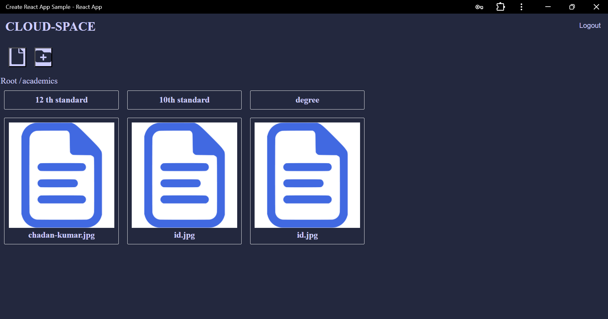

# Cloud Space

Cloud Space is a web application that allows users to manage their files and directories. Users can create new directories, add files, view files, register, login, logout, and reset their passwords. The application uses Firebase Authentication for user management and Firebase Firestore for storage and database.

## Features

- **User Authentication**: Register, login, logout, and password reset functionality using Firebase Authentication.
- **File Management**: Create new directories, add files, and view files stored in Firebase Firestore.
- **Responsive Design**: User-friendly interface that works on various devices.

## Technologies Used

- **Frontend**: React.js
- **Backend**: Firebase Authentication, Firebase Firestore, Firebase Storage
- **Styling**: CSS

## Screenshots

### Register


### Login


### Home


### Forgot Password


## Getting Started

### Prerequisites

- Node.js and npm installed on your machine.
- Firebase account and project set up.

### Installation

1. Clone the repository:
    ```bash
    git clone https://github.com/chandankumarm55/cloud-space.git
    ```

2. Navigate to the project directory:
    ```bash
    cd cloud-space
    ```

3. Install dependencies:
    ```bash
    npm install
    ```

4. Set up Firebase:
    - Go to the Firebase Console and create a new project.
    - Enable Authentication and Firestore Database.
    - Obtain your Firebase configuration and add it to your project.

5. Create a `.env` file in the root of your project and add your Firebase configuration:
    ```env
    REACT_APP_FIREBASE_API_KEY=your_api_key
    REACT_APP_FIREBASE_AUTH_DOMAIN=your_auth_domain
    REACT_APP_FIREBASE_PROJECT_ID=your_project_id
    REACT_APP_FIREBASE_STORAGE_BUCKET=your_storage_bucket
    REACT_APP_FIREBASE_MESSAGING_SENDER_ID=your_messaging_sender_id
    REACT_APP_FIREBASE_APP_ID=your_app_id
    ```

### Running the Application

1. Start the development server:
    ```bash
    npm start
    ```

2. Open your browser and navigate to `http://localhost:3000`.

